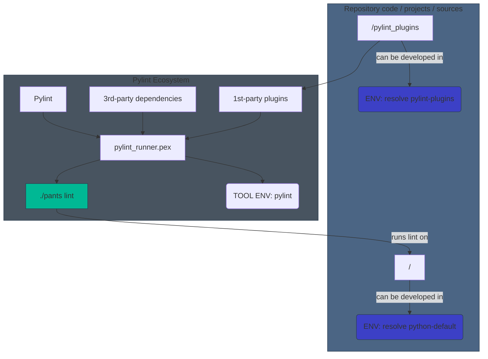

# Demo code for Pylint plugins integration in a Pants-managed repository

This demo comes along this [Medium post](https://medium.com/doctrine/industrialized-python-code-with-pylint-plugins-in-pants-321d9cbad07a) about enabling Pylint 1st-party plugins in a repository managed by Pants.

More info:
* about [Pants](https://www.pantsbuild.org/)
* about [Pylint 1st-party plugins](https://pylint.pycqa.org/en/latest/development_guide/how_tos/custom_checkers.html)


## Quick Setup

Install dependencies:
```bash
./pants export ::
```

This creates several virtual environments. Among them, you'll find:
* `pylint_plugins` → the virtual env for custom pylint plugins (1st-party plugins)
* `python-default` → the virtual env for the runtime code
* `tools/pylint` → the virtual env for tools, in particular pylint here, which includes our 1st-party plugins and 3rd-party plugins)

## Lint with 1st-party pylint plugin enabled 

In order to check that the 1st-party pylint plugin is working, a sample of code has been added to [project/flows/example/tasks/dummy.py](./project/flows/example/tasks/dummy.py). This code sample is not valid against the rule defined in the pylint plugin.

You can now run the linter:
```bash
./pants lint ::
```
and you will get an error **C9002** (_invalid-task-definition-name_) as expected.

## An overview of how the 1st-party plugins work

Ultimately, what you're looking for is that you can run your custom linter rules on your runtime code, and this can be illustrated with this:

